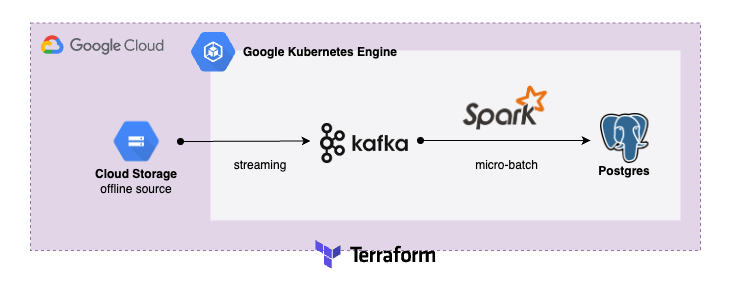
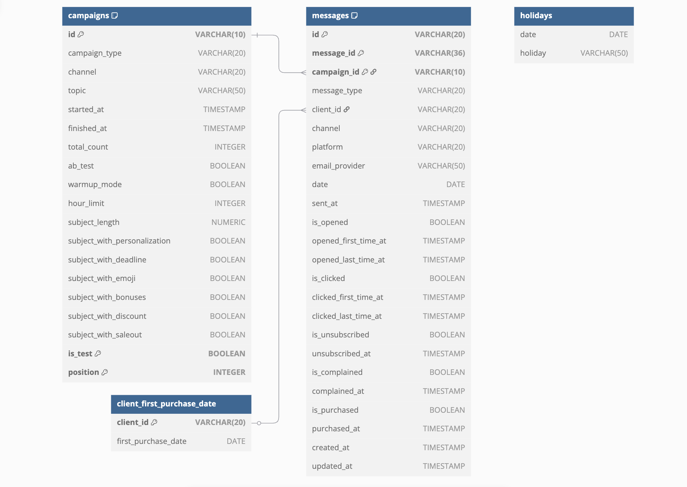
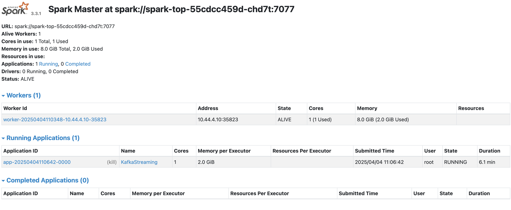
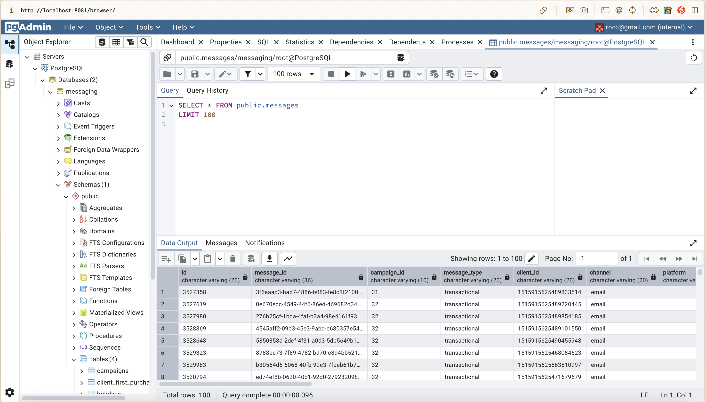

# E-commerce Multichannel Messages Streaming Framework and Pipeline

## Overview
Build a microservices-based Kubernetes infrastructure to support a Kafka streaming pipeline that performs extract, transform, and load (ETL) operations into PostgreSQL using PySpark.  

## Architecture


The project architecture revolves around seamless data processing pipelines, orchestrated by Kubernetes containers. Events originating from messages offline file are captured in a streaming data producer job, forwarded to a Kafka topic named `messages_data`, processed through a micro-batch PySpark pipeline for transformation, and stored into PostgreSQL. All of the intrastructure are built using Terraform for continuous and stable deployment.

## Data Source
This dataset in this project from [Kaggle - E-commerce multichannel direct messaging](https://www.kaggle.com/datasets/mkechinov/direct-messaging) is about multi-channel messages of medium sized online store for 2 years.
Main table: `messages` with some information:
1. **Campaign**
2. **Channel**: email, web push, mobile push, SMS.
3. **Type**:
    1. Bulk campaigns are sent for sale outs and before holidays to stimulate sales and bring back customers.
    2. Trigger messages are sent automatically based on user's behavior. 
    3. Transactional messages are used for some kind of information delivery process, such as: order delivery status changed.
4. **Opened (when)**
5. **Clicked (when)**
6. **Purchase**
7. **Etc**: See attached dataset for detailed info of every property.    

    

## Data Flow 
1. **Data Producer**: Scrapes data and continuously publishes it to the Kafka topic `message_data`.
2. **Kafka Message Queue**: Decouples the pipeline using Kafka as a message queue, ensuring flexibility and stability for downstream consumers.
3. **Data Consumer with PySpark**: Cleans and processes streaming message data using PySpark to enable near-realtime ETL.
4. **PostgreSQL Sink**: Writes the cleaned data into PostgreSQL as part of an E-commerce multichannel messaging data mart.


## Setup the Environment
1. Install `terraform` and `gcloud` for the following deployment.

2. Run the terraform script if you need to re-deploy your cluster.
    ```bash
    gcloud auth login
    gcloud auth application-default login
    ```
    ```bash
    cd terraform/
    terraform init
    terraform plan
    terraform apply
    ```
    Make sure your ip is included in the list of authorized network.

3. Connect to cluster to interact with Kubernetes.
    ```bash
    gcloud container clusters get-credentials cluster-1 --zone [zone] --project [project_id]
    ```

4. (Only first time) Annotate default Kubernetes service account (KSA)
    ```bash
    gcloud storage buckets add-iam-policy-binding gs://[bucket_name] \
    --role=roles/storage.objectViewer \
    --member=principal://iam.googleapis.com/projects/[project_number]/locations/global/workloadIdentityPools/[project_id].svc.id.goog/subject/ns/default/sa/default \
    --condition=None
    ```

5. Deploy your pods/jobs with Kubernetes yaml files:
    ```bash
    cd ../kubernetes/
    kubectl apply -f [folder_name]
    ```

## Usage with the Framework
1. Check the status of `Kubernetes` pods and services.
    ```bash
    kubectl get pods -owide
    kubectl get services 
    kubectl logs -f [pod_name]
    kubectl describe pod [pod_name]
    ```

2. Monitor `Kafka` producer, consumer, and topic metrics to gain insights into message flow and system performance.
    ```bash
    kubectl exec -it [kafka-pod-name] -- /bin/bash
    cd /bin
    kafka-console-consumer --bootstrap-server kafka-service:9092 --topic message_data --from-beginning
    ```

3. Access the Spark Web UI to monitor Spark job execution:
    ```bash
    kubectl port-forward svc/spark-master-service 8080:8080
    ```
    Then, open "http://localhost:8080" in your browser.
    
    - `Workers`: 1 alive workers with 1/1 core and 2.0GiB/8.0GiB memory used.
    - `Running Applications`: 1 core and 2.0 GiB is used by Kafka Streaming Job.

4.  Start your data processing and analytics workloads.
    1. Connect to `PostgreSQL` service directly
        ```bash
        kubectl exec -it [postgres-pod-name] -- psql -U root -d messaging
        ```
        Access data using SQL statements:
        ```sql
        -- Show all table
        \dt 

        -- Show top 10 records of message data
        select * from messages limit 10;
        ```
    2. On the other hand, you can visit pgadmin console to explore messages data:
        ```bash
        kubectl port-forward svc/pgadmin-service 8081:80
        ```
        Then, open "http://localhost:8081" in your browser.
        


## Highlight Components
1. Microservice Deployment on Kubernetes: Managed multiple stateful and stateless services or jobs with Kubernetes, ensuring modularity and orchestration across components.
2. Terraform for Continuous Deployment: Simplified deployment configuration and improved collaboration by managing infrastructure as code with Terraform.
3. Distributed Kafka broker: Using Kafka to decouple services, enabling a scalable and flexible message platform.
4. Standalone Spark Cluster: Initiated a Spark cluster in standalone mode, consisting of a master, a worker, and a Spark job to implement a real-time streaming consumer.
5. Mounted PostgreSQL with GCS Fuse: Used `gcsfuse.csi.storage.gke.io` to mount CSV files from a GCS bucket into PostgreSQL for initializing data.


